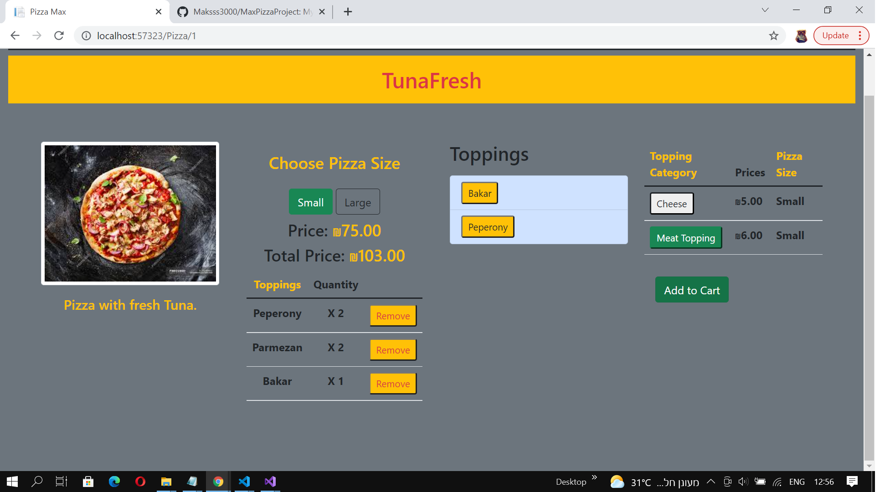

#  Pizza Project
### *I am still working on this project. So I will update Readme file when I will add new features to the project.*
### About the Project.

*Technologies* :
+ **Platform:**
  + **ASP .NET CORE**
+ **Languages:**
  + **C#**
  + **JavaScript**
  + **Blazor**
+ **Front End**:
  + **HTML5**
  + **CSS**
  + **Bootstrap**
+ **Database**:
  +  **Microsoft Sql Server.**
  +  **ORM : *Entity Framework*.** 
+ **Design Pattern**:
  + **MVC**
___
##  Main Page.
___
***Main page***

### User can choose pizza by Category.
***Category Mix***

  
### User can choose pizza size , different toppings and add product to cart.

### User Cart

